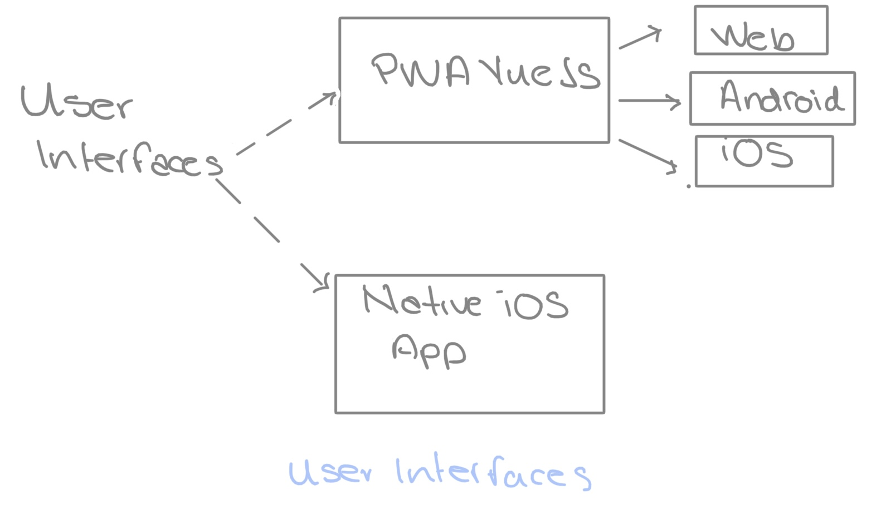
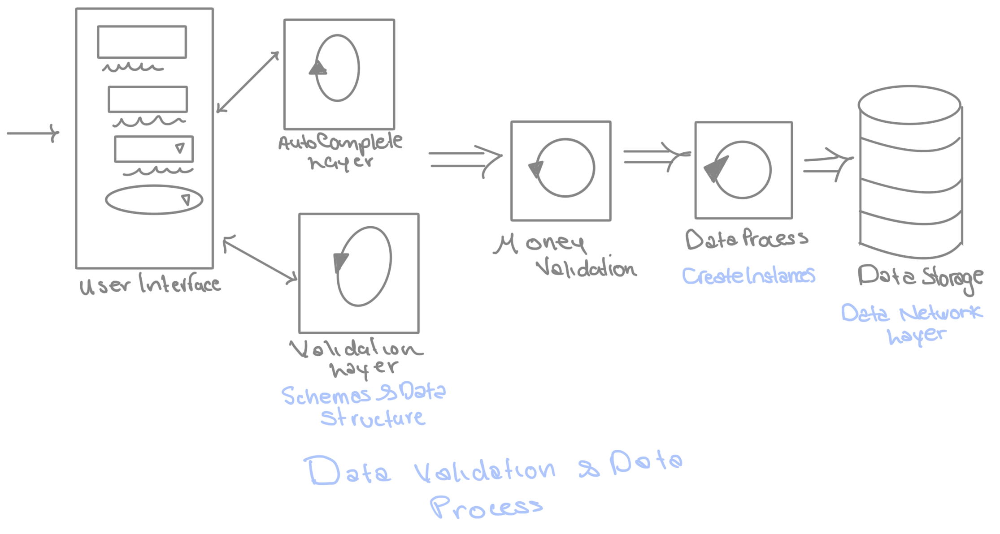
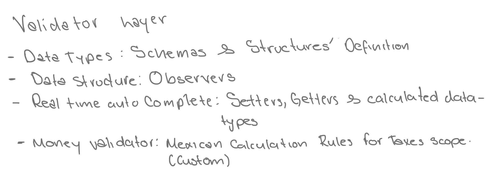
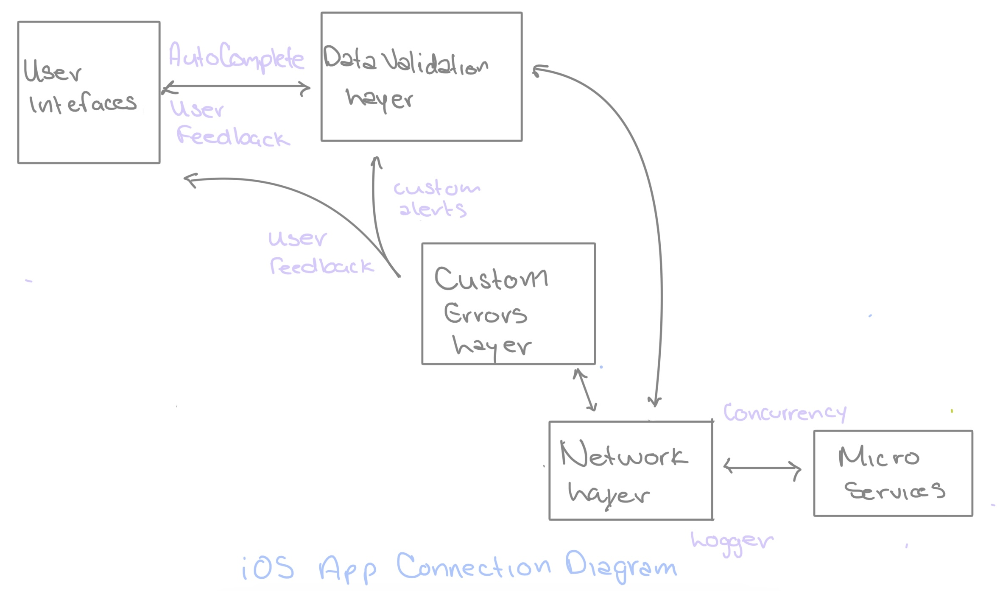

# Functionalities and Flow Design

As mentioned before, Chain has multiple microservices that has been connected to a Graphql service. But for the native app, the connection will be made to the microservices by itself and the responses will be managed at swift.

Now the user interfaces will be distributed as following next:

## User flows
### Data validation 
Every insert will be protected by a data validation layer that will be included by:
- Schema validation
- Data type and format validation
- For necessary cases (sales) auto-complete process will be executed
- Money validation
- Data process (format to JSON)
- Data storage (by using microservices)

### Data flow to microservices
In order to prevent services errors, all the service connections will be protected by:
- The network layer, which will provide services functions to make HTTP requests and manage the HTTP responses
- Services middlewares, which will provide the functions to make requests to Chain microservices according to each one
- A Logger Layer, which will provide feedback on test mode for external request
- Custom alerts according to HTTP responses to give feedback to the user when something is not working as expected or when action is not according to user rules. These will be special cases like:
- Client tax id is not valid for SAT system
- A client has been registered with a specific name or tax id yet
- The process requested has been finished successfully

## Background process
We have many services and creating sales, payments and other processes depend on many services to be completed and have all information updated. Not all the processes related are crucial, because of that, it would be a good idea to have a singleton queue to manage the background processes with NSObject.

In that way, we can request interface refresh or update when a series of processes associated together is finished. These processes will be executed as async ones in order to not block the thread(s) and being executed without stop user experience. 