# Services Design

The Chain app has been designed to be a PWA connected to Graphql services supported for microservices. These is the connections designed:

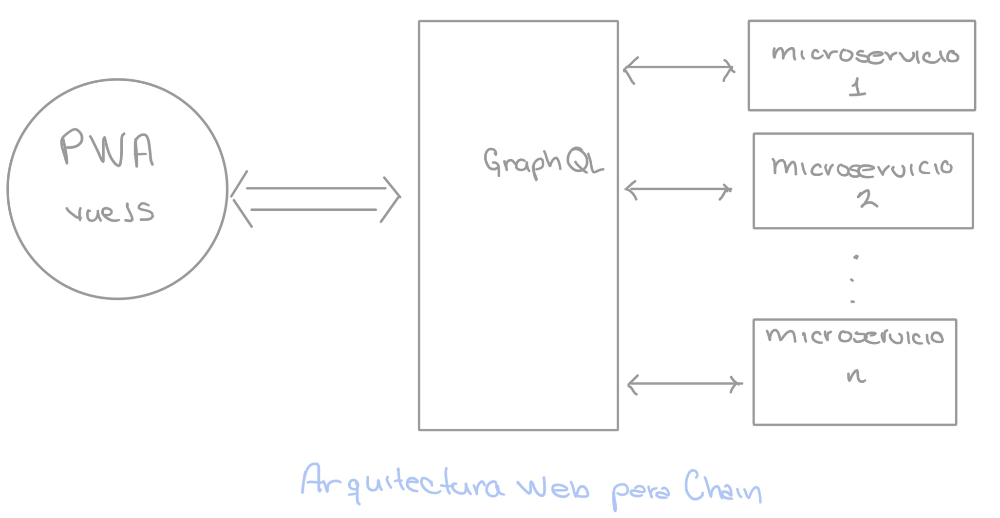

The services are distributed on almost 12 own services and we use 4 more services from the same company. 
We are working to unify these services at a core services architecture in order to reduce the number of services, make more understandable the scopes and know-how of the services. These are the big scopes that will compose the final architecture:
 
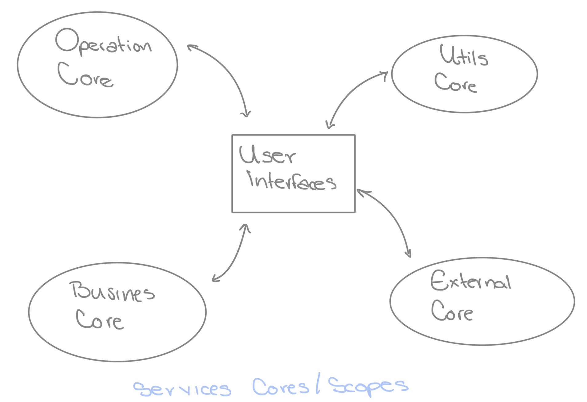

As mentioned before, the current architecture is distributed among many services which can be included on one of the different scopes. The next list will show how services are currently distributed:

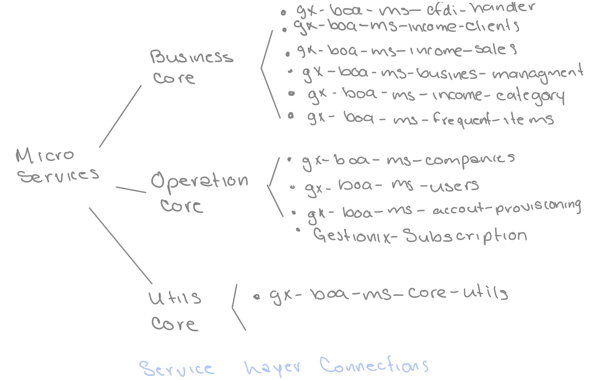

## Big Scopes
### Operation Core
This core will include all the information and relationships related to:
- Users
- Companies
- Subscriptions
- Company or users information to allow Mexican rules to be completed 
- Subscriptions

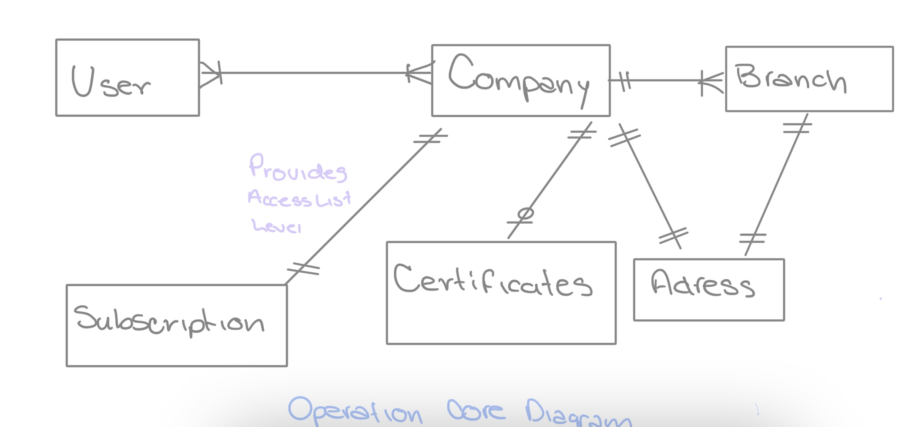

### Business Core
This core will store and manage all the information related to the business logic like:
- Sales
- Payments
- Accounts
- Bank reconciliation
- Transactions
- Expenses 
- Clients
- Categories
- Frequent items
- Invoices

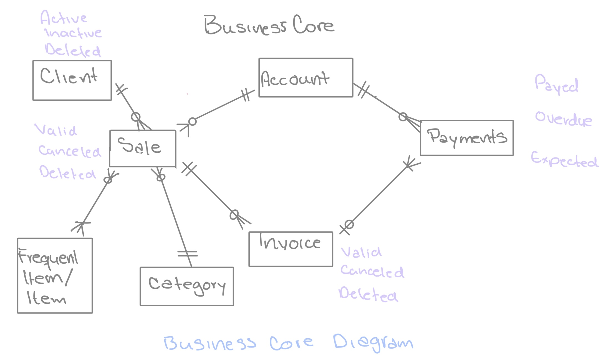

### Utils Core
This core will be in charge of utilities that will be useful for customer care, migrations, user mana and recurring task. With this service you will have:
- Pending items
- Notifications
- Slack commands for customer care
- Migrate user from other administrative services
- Data analysis 
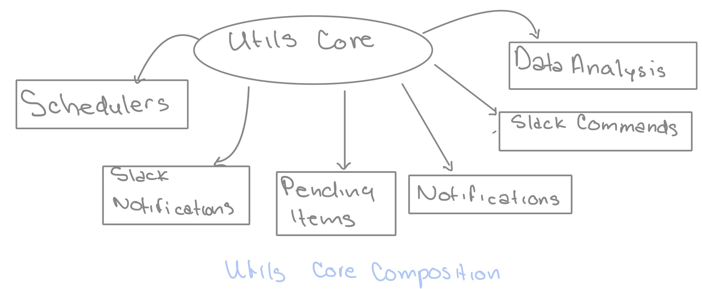

### External Core
This scope will be helpful in integrating and customizing the Chain functionalities with other company APIs and third party services.

We can currently connect with stripe and we will connect to other receive payments services, with others sale points and being included on other apps and services to join their items with our sales.

This implementation includes public links for the sales generated and actions related to that public sales. 
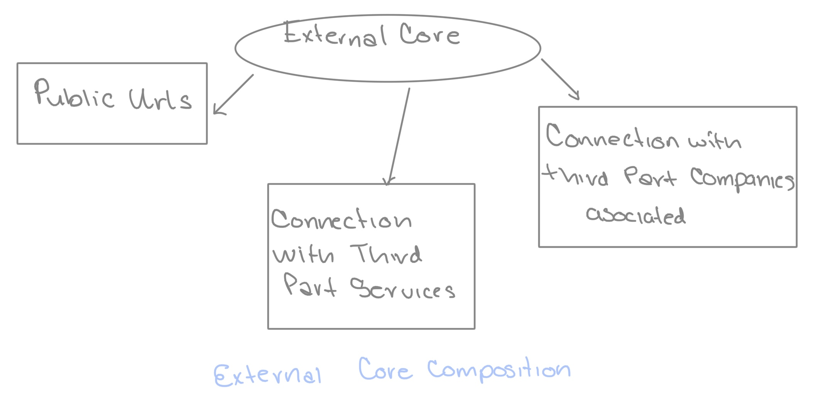

## Current Services design
There is some of the services database design.
### Companies
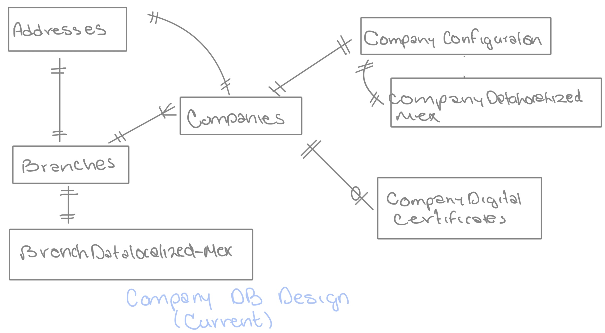

### Clients
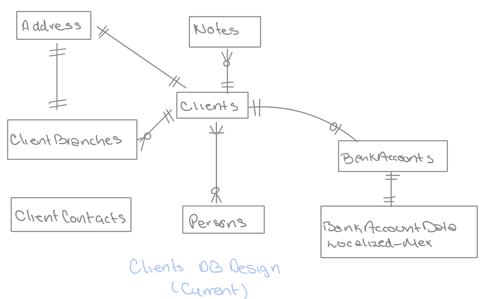

### Sales
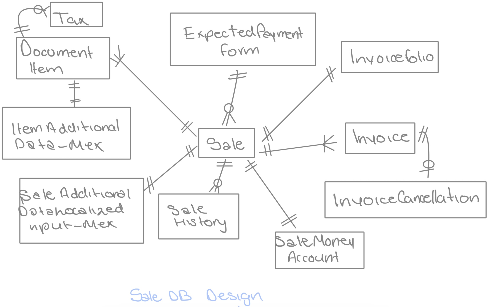

### Categories
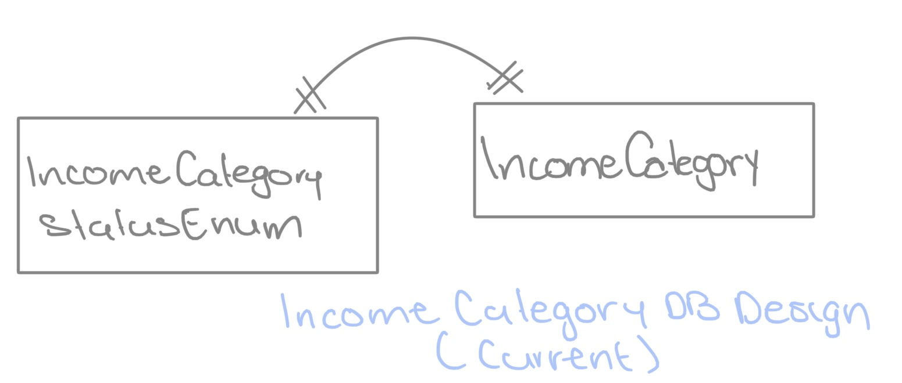